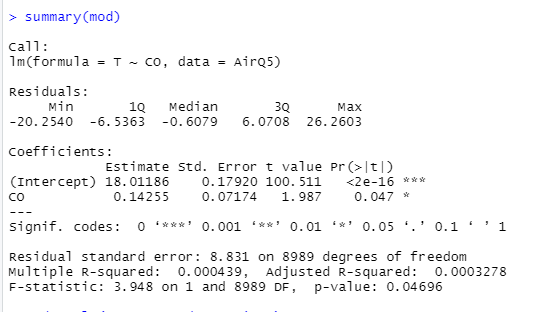
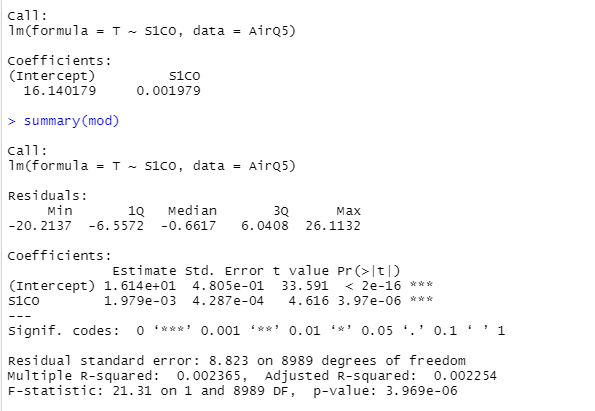
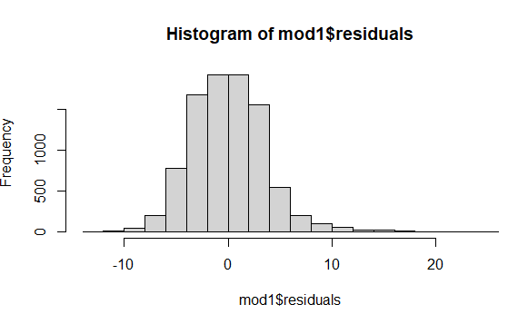
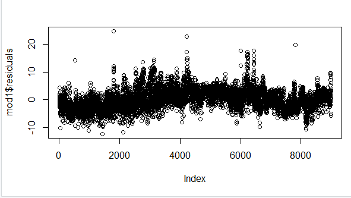
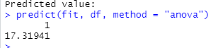



` `**SCHOOL OF DIGITAL TECHNOLOGIES**

**Te Wāhanga Whakaako Kaipakihi me te Hangarau Mōhiohio**

**563.784 Advanced Data Analytics – Semester 1 2022**

**Project Part A**

**Italian Air Quality Analysis and prediction** 

**Samudu Dissanayake**

` `**2022/06/13**

# **Contents**
[1. Introduction	2](#_Toc106047625)

[1.1 Data source	2](#_Toc106047626)

[1.2 Description of the data set	2](#_Toc106047627)

[1.3 Preprocess data	5](#_Toc106047628)

[1.3.1 General correction method for missing values in a data frame	6](#_Toc106047629)

[2. Motivation	9](#_Toc106047630)

[2.1 Literature review	9](#_Toc106047631)

[2.2 Importance of big data frameworks and analytics	9](#_Toc106047632)

[2.3 Importance of predictive analysis	9](#_Toc106047633)

[3. Problem definition	10](#_Toc106047634)

[3.1 Problem definition	10](#_Toc106047635)

[3.2 Identify classification or regression analysis	10](#_Toc106047636)

[3.2.1 Difference between classification	11](#_Toc106047637)

[4. Methods	11](#_Toc106047638)

[4.1 Choose method for Air quality dataset	11](#_Toc106047639)

[5. Results	12](#_Toc106047640)

[5.1 Simple Linear regression	12](#_Toc106047641)

[5.1.1 Linear regression Result description	14](#_Toc106047642)

[5.2 Multiple linear regression	15](#_Toc106047643)

[5.2.1 Results	16](#_Toc106047644)

[5.2.1 Multiple Linear regression results description	16](#_Toc106047645)

[5.2.2 Prediction for multiple linear regression	19](#_Toc106047646)

[5.3 Decision tree	19](#_Toc106047647)

[5.3.1 Prediction decision tree	21](#_Toc106047648)

[Appendix	21](#_Toc106047649)

[References	22](#_Toc106047650)

#
# **1. Introduction**
## **1.1 Data source**
Italian Air quality Data set

Our team selected the Air quality data set from Machine Learning Repository Website, 

<https://archive.ics.uci.edu/ml/datasets/air+quality>

This data set contains the data about average gas concentrations in an Italian City. These responses are collected from the multisensory device which is deployed in the significantly polluted area in the city. The device collected 9358 instances from March 2004 to February 2005.

Figure 1: Attributes of the data set

## **1.2 Description of the data set** 

Identifying air quality is important for public authorities as well as businesses because both parties are responsible for controlling emissions and protecting the environment. Many research shows, High concentration pollutants can cause many harmful effects on human health. Also, Air pollutants gases affect to increase the temperature. Increasing temperature by day by day is a very challenging problem for human health. So, Identifying the relationship between certain harmful air emissions and reducing the emission levels by using government policies and rules is very important for protecting the environment and human health.

Measuring air pollution levels is essential for reducing harmful gas emissions and reducing the global warming problem also reducing black carbon pollutants is important for protecting people's health and the environment. (Air Pollution and Climate Change,2010). Also, the research mentioned, increasing concentrations of greenhouse gases changes climates by rising temperature rapidly.

EPA says Since Industrial era start in 1990, green houses gases are increasing rapidly 43% from 1990 to 2015. major emissions are Carbon dioxide, Methane, Nitrous oxide, and Fluorinated gases. (Climate change indicators, 2015)

Nasa.gov article says Major greenhouse gases (Carbon dioxide, Methane, Nitrous oxide, and Fluorinated gases) contributes to an increase a few degrees of temperature. also, water vapor shows humidity in the air and when humidity increases temperature increase rapidly (Nasa.gov, 2008)

Co2 pollutant is a major greenhouse gas among other emissions because Co2 shows for 76% of total greenhouse gases. (Global Carbon Dioxide Emissions,2020)

Above research, articles provide a general idea about the data set and supports the understanding of the value of each attribute and get an awareness about the dataset also predicts the analysis method for this project.

` `After using R studio for the Air quality data set below information are identified,

Libraries for air quality data analysis project

Figure 1.1: R libraries

Codes 

Figure 1.2: Codes for identify data set

dim () code shows, this data set has 9357 instances and 15 attributes. view () codes show view of data set and view gives general idea about data types and missing values. According view all values are numerical and multiclass classification except date and time.

` `Head () command shows attributes names and first few rows.

Levels () code shows the level attributes of the variables. It shows null results in the air quality dataset because this data set has no categorical values. sapply() code shows data types Date - "POSIXct" "POSIXt" ,Time-"POSIXct" "POSIXt" ,CO(GT)`- "numerc",PT08.S1(CO)` -"numeric",NMHC(GT)`- "numeric",C6H6(GT)`- "numeric"PT08.S2(NMHC)`- "numeric",NOx(GT)`- "numeric",PT08.S3(NOx)`- "numeric",NO2(GT)`-"numeric",PT08.S4(NO2)`-"numeric",PT08.S5(O3)`- "numeric",T- "numeric",RH- "numeric",AH -"numeric"

cbind() code is for combine specified vector or data frame by columns but above data set has no categories.

Finally, summary () is very important for get summary output in every column. This shows what is the summary results for the Air Quality dataset.

Figure 1.3: Data Set summarization

 Figure 1.4: Attributes relationship Plot chart 
## **1.3 Preprocess data**

Preprocessing data is a crucial step before any analysis model start because in this stage raw data is transformed into an understandable format and clean raw data. 

This paragraph focuses on reading the attributes of the Air Quality data set and converting it to the data frame in the R workplace.

**Step 1** - Include libraries for reading the data set:

- library("readxl")
- AirQ <- read\_excel("AirQualityUCI-1.xlsx")

**Step 2** - Read the data set using an R programming language 

Using command get an idea about the structure of the data set and view the first and last 10 rows.

Figure 1.5: Data types

Check first 10 rows and last ten rows. Head (AirQ, n=10),tail(AirQ, n=10)

Figure 1.6: Head and tail data

This data frame shows many -200 values in the dataset, so these data represent missing values in this data set. For further analysis, these -200 (missing values) need to convert blank space using an Excel sheet. After that saved a new excel worksheet on Air quality used for the further cleaning process.

### 1.3.1 General correction method for missing values in a data frame

To get accurate results missing values need to be dealt with in the data preparation step.

This is a guide to manipulating missing values

More than 40% missing values in the column - Delete the column

More than 15% of missing values - replace with average values (numeric data)

Less than 15% missing values - consider deleting the row

The below code is used to find the missing values in each attribute in the Air Quality data set.

- colSums(is.na(AirQ))

Figure 1.7: Missing values

According to the above results,NMHC(GT)- 8443 is showing more than 40% missing values so this attribute is removed.

- AirQ1 <- AirQ[ , ! names(AirQ) %in% c( "NMHC(GT)")]  
- colSums(is.na (AirQ1))

Figure 1.8; Missing values after NMHC remove

There are three attributes (CO(GT)), NOx (GT), and NO2(GT) that have missing values of more than 15% so these attributes' missing values are replaced with average values.

Rename columns name for remove non-functional error. R program not respond for these attributes names and shows In addition: Warning message:Unknown or uninitialized column: `CO`. ) Error message

. So, follow codes are used.

- (> AirQ1$CO(GT)[is.na(AirQ1$CO(GT))] <- mean(AirQ1$CO(GT), na.rm = TRUE)
- Error in mean (AirQ1$CO(GT), na.rm = TRUE) 

Figure 1.9: Change columns name

The next step is replaced missing values using average values using below codes and check the missing values result.

- AirQ2$CO[is.na(AirQ2$CO)] <- mean(AirQ2$CO, na.rm = TRUE)  # Replace NA in one column
- AirQ2$NOx[is.na(AirQ2$NOx)] <- mean(AirQ2$NOx, na.rm = TRUE)
- AirQ2$NO2[is.na(AirQ2$NO2)] <- mean(AirQ2$NO2, na.rm = TRUE)
- colSums(is.na(AirQ2))

Replace with mean values.

Finally, there are a few attributes that show Less than 15% of missing values These missing values are deleted by row.

- AirQ3 <- na.omit(AirQ2)
- colSums(is.na(AirQ3))

After clear missing values all attributes shows zero missing values.

- colnames(AirQ2)

Figure 1.10: Clear data set

Using sapply(AirQ1, class)code shows, All columns except the time column have the appropriate data types and values, Time column convert into a specific format.

- library(lubridate)
- AirQ$time <- format(as.POSIXct(AirQ$Time),format = "%H,%M,%S")

Finally, reorder the columns for a proper data frame.

- AirQ3[ ,c(1,2,16,3,4,5,6,7,8,9,10,11,12,13,14,15)] Reorder data columns

Figure 1.11: Final Data set

# **2. Motivation**
## **2.1 Literature review**

This Air Quality data set has 12 pollutants gases data after proper literature review and identify data set using R studio give idea about data set. In today's world, intense human activity pollutes the air, and increasing air pollution causes various health problems and environmental problems such as respiratory diseases, risk of miscarriage, premature death and many more (Liu et al., 2020)

Identifying the relationship between emissions data and temperature patterns is very crucial for government parties to policy making for protecting the environment. Some articles show some gas emissions increase air humidity, and this process is correlated to increasing temperature. (Liu et al., 2020)

` `Identifying how temperature (target variable) changes according to gas emissions is very important for predicting and controlling gas emissions also using the data set we can make predicting model for identify temperature changes according to gas emissions. These kind of insights and predictions are very important for governments and businesses. So, in this project focus on regression analysis among temperature and pollutant gases and water vapor. Because increasing these attributes are affected by climate change and global warming.

## **2.2 Importance of big data frameworks and analytics**

Big data analysis is an advanced form of analysis that incorporates complex applications with elements such as prediction models, statistical algorithms, prediction models and analysis powered by analytics systems. Many businesses and organizations use big data analysis for improving business-related outcomes. Big data analytics benefits are improved operational efficiency, improved revenue, making effective strategies, planning marketing strategies, and making policies and rules. In so many ways big data analysis provided competitive advantages for organizations. (TechTarget, 2022)

## **2.3 Importance of predictive analysis**

In this predictive analysis of past years, data patterns were used to predict specific data outcomes using different algorithms. Also, these identifying algorithms can be used further as decisions are automated and make an accurate prediction about the future environment safety. 

Different processes are using Data mining. There is three most common standards data mining process. 

- Cross-industry process for data mining
- Semma-Sample, explore, modify, model, assess
- Knowledge discovery in databases

The cross-industry process provides a structured and well-organized plan for any data mining project.

` `In this project,

The first stage is to Identify the value of predictive analysis for this dataset. For that do background check for air quality research and get a good understanding about environmental pollution and different gas emissions. Getting an idea about Dataset is the next important step because it provides an accurate picture of the data set, and it will allow getting accurate results. So, this step explores Air Quality data set and describe each attribute.

Data preprocessing (data consolidation, data cleaning, data transformation, data reduction) is next important step for good project.

In fourth step I used different modeling assumptions and modeling assumptions for data set and create test design for this project but Find the best data modeling through research is challenging step.

Then Data evaluation step is for evaluation the results and review of the process

After data evaluation, monitoring and maintenance plan, deployment plan and the final report can be generated under the final Data presentation and deployment step. also, I will do review the documentation.
# **3. Problem definition**
## **3.1 Problem definition**

Defining the problem statement is an essential task for the success of the project. Well defines problems statement improves future prediction and gets useful other insight from the data set.

After a literature review of the domain, we can identify and define which certain insights or predictions need to be used for this data set.

Greenhouse gases are important for keeping the earth's climate habitable for species. the main gases are carbon dioxide, nitrous oxide, methane and water vapor, and fluorinated gases. But after the industrial revolution recent increase in greenhouse gases create temperature increases by trapping heat and make respiratory diseases from air pollution.  

Identifying the relationship between temperature and emission gases can use to identify further temperature increases. Using this predicting analysis, governments can control primary greenhouse gas emissions from human activities using rules and regulations.

## **3.2 Identify classification or regression analysis**

Understanding supervised and unsupervised data learning is very important before starting the data mining process. Supervised learning involves features labeled input and output training data while unsupervised data only has features that are not directly mentioned by labels or raw data. (Karla, 2021)

Regression analysis and Classification analysis algorithms are Supervised Learning algorithms used for prediction in Machine learning. Regression analyses are mainly used to predict the continuous values such as weather prediction, price increase, age, and salary while Classification analyses are used 

to predict or classify the different discrete values such as Male or Female, True or False, Female or Male, Spam mail or Not Spam mail. 

## **3.2.1 Difference between classification**

Classification analysis categorized the dataset into different classes. Regression analysis has continuous values.

There are different types of classification algorithms,

- Logistic Regression
- K-Nearest Neighbours
- Support Vector Machines
- Kernel SVM
- Naïve Bayes
- Decision Tree Classification
- Random Forest Classification

There are different types of regression algorithms,

- Simple Linear Regression
- Multiple Linear Regression
- Polynomial Regression
- Support Vector Regression
- Decision Tree Regression
- Random Forest Regression

After the above brief description, I decided which algorithm is appropriate for this air quality predicting analysis. The air quality data set can use regression algorithms because the Air quality data set has continuous nature variables and these variables help to find the correlation between different gas pollutions (independent variables) and temperature (target variable). 

Also, this project is predicting the continuous variables changes in temperature according to gas emissions. so, regression algorithms are the best match for this Air quality data analysis project. And we can reject calcification algorithms because classification analysis is used with discrete values.
# **4. Methods**
## **4.1 Choose method for Air quality dataset**

Training model on air quality data set is the next step in this project. This step can process in three steps,

- Choose an algorithm
- Overfit the model
- To reduce overfitting with regularization there are numerous techniques and models 

to solve the problem.

Having many alternative methods is beneficial, but choosing which model to apply to get, useful insights are essential therefore many performances indicators use to evaluate a model. According to the problem definition chapter we identified our air quality data set has continuous data so Regression analysis algorithms under supervising data are used best to implement and get our solution.

This project is using regression algorithms After identifying Air quality data variables. Because air quality data set has independent variables numerical data for major greenhouse gases and RH water vapor data also there is temperature measurement relatively gas emissions. There are few regression models, but this project is decided to follow, 

- Simple linear regression 
- Multiple linear regression
- Decision tree

To get a different result and find the best outcome for better decisions for stakeholders is very important, for example governments and businesses can reduce their emission level and control the heat trap according to correct predictions.

Fields of predicting modeling is concerned minimized the errors of model and get most accurate results for the project. Linear model assumes linear relationship between input variable and target variable. If there is single input variable it called simple linear regression model and if there are multiple input variables it called multiple linear regression model.
# **5. Results**
## **5.1 Simple Linear regression** 

This is a parametric test so before starting simple linear regression. 

There are few assumptions for linear regression,

- Normality
- Homogeneity of variance
- Independence of observations

Formula for simple linear regression

**Y = Bo + B1X + E**

Y 	= Target variable

Bo	= Intercept

B1 	= Regression coefficient

X 	= Independent variable

E	= Error

In this project is checked linear relationship between temperature and CO because literature review shows Co affects global warming 76% percent. There are two types of CO gases in this data set CO, PTO8.S1(CO)

Codes for simple linear regression

- CO

Figure 5.1.1: Linear regression codes

Results are below,

Figure 5.1.2: Simple linear regression results

- PTO8.S1(CO)

Figure 5.1.3: Linear regression codes for PTO8.S1(CO)

Results

Figure 5.1.4: summary of results
### **5.1.1 Linear regression Result description**

Results are shows how is the significant relationship of these variables’- values and coefficients is very crucial for identify nature of the analysis. First CO p value is 0.046 and PTO8.S1(CO) p value is 3.96e-6 both values are less than 0.05 and so this data provides enough evidence to reject the null hypothesis and this data shows nonzero correlations. 

Coefficients values shows how much mean of target variables changes according to independent variables. both results show plus values as 0.14255 and 1.9793-6. 

R-squared shows the goodness of fit in other words R2 shows the proportion of the variance in the target variable(Y) which explained by the independent variable(X). Both CO types of results shows low r squared as 0.000439 and 0. 002365.generally high R2 is good sign Low r squared indicate the problem with a linear regression model but before getting any conclusion of the model need to analyze other factors.

Prediction about temperature changes according to CO

This code shows how to change temperature when CO changes.

Figure 5.1.5: Code for predicting temperature

## **5.2 Multiple linear regression**

Multiple linear regression model is check relationship between dependent variables and two or more independent variables. Also, Multiple linear regression can use for predicting the value of dependent variables using several independent variables.

Formula

Y = Bo + B1x1 + B2x2 + e

Y 	= Dependent variable

Bo 	= Intercept

B1,B2	= Regression coefficient

x1,x2	= Independent variables

e 	= Randoms error

Assumption

- Independence of observation
- Between Independent variables and dependent variables have linear relationship 
- Multivariate normality
- Constating variance of the residuals
- Selected independent variables are not highly correlated with each other Codes with Multiple linear regression.

According to literature review I identified there are strong relationship between temperature and emission gases and water vapor (RH) .so in this multiple regression model analyzed relationship between emission gases and water vapor impact for temperature changes.

Figure 5.2: Multiple linear regression

### **5.2.1 Results**

Figure 5.2.1: Multiple linear regression results
### **5.2.1 Multiple Linear regression results description**

P-value - all independent variables p values are less then to the significant level 0.05 and there is a significant association between target variable and independent variables

R-sq shows how well fit and how well predicts the response according to observations. This data set has high R-sq = 0.8433

Coefficient is 29. 933.This value shows how much target variable(temperature) is increased when independent variables increased by 1 point. In this data set coefficient is positive value.

- CO	 -0.7619181 0.0628824 -12.117   <2e-16 \*\*\*
- S1CO      -0.0070652 0.0004771 -14.809   <2e-16 \*\*\*
- C6H6      -0.4489483 0.0316879  -14.168   <2e-16 \*\*\*
- NMHC 	 -0.0087450  0.0010597   -8.252   <2e-16 \*\*\*
- Nox	   0.0144795  0.0004444   32.579   <2e-16 \*\*\*
- s3Nox	 -0.0118079  0.0002920  -40.442   <2e-16 \*\*\*
- S5O3      -0.0039702  0.0002680  -14.814   <2e-16 \*\*\*
- NO2        -0.0341452  0.0016021  -21.313   <2e-16 \*\*\*
- S4NO2     0.0280189  0.0002369  118.273   <2e-16 \*\*\*
- RH         -0.3258837  0.0028603 -113.932   <2e-16 \*\*\*

According to above table we can see of gases coefficients shows negative values and these emission gases standard error shows smaller values.

Standard error is 0.8767426   on 8980 degrees of freedom. Standard error is indication of the reliability of the sample mean. If small standard error low data points and fitted values difference is low. Also, Larger sample normally shows small standard error. 

Other useful functions.

- coefficients(mod1) # model coefficients
- confint (mod1, level=0.95) # CIs for model parameters
- fit1ted(mod1) # predicted values
- residuals(mod1) # residuals
- anova(mod1) # anova table
- vcov(mod1) # covariance matrix for model parameters
- influence(mod1) # regression diagnostics

**Histogram chart** 

Histograms shows skewness of multiple linear regression. This data shows good skewness.

` `codes and histogram

Figure 5.3 Codes for histogram

Figure 5.2.2: Histogram chart

**Plot chart for different emissions and Temperature**

Figure 5.2.3: Plot chart

###
### **5.2.2 Prediction for multiple linear regression**

Prediction of Temperature changes according to independent variables.

Figure 5.2.4.: Multiple linear regression prediction codes

## **5.3 Decision tree**

Decision tree is a algorithm which is like tree like structure. Decision trees use both classification and regression analysis. Decision tree is use for predicting the class or value of dependent variable. In this project used for predicting the temperature value by using other independent variables.

Decision tree has below advantages and disadvantages. 

Advantages are easy to use, missing values are not affecting to decision and considering all possible decisions. But decision tree is not good approach as random forest and decision tree needs higher times for calculations which larger datasets.

**Decision Tree** 

Figure 5.3.1 Decision tree

Codes for R

- Plot the tree 
- fit <- rpart(T ~ CO+S1CO+C6H6+NMHC+NOx+s3NOx+S5O3+NO2+S4NO2+S5O3,RH,method = "anova", data =AirQ5)

- Output to be present as PNG file
  - png(file = "decTreeGFG.png", width = 600, 
  - height = 600)

- Plot
  - plot(fit, uniform = TRUE,
  - main = "Temperature Decision Tree using Regression")
  - text(fit, use.n = TRUE, cex = .7)

### **5.3.1 Prediction decision tree**

According to decision tree shows results organizations can make predictive analysis below codes shows predictive codes and results after using these values, (CO = 2.2, S1CO  = 1, C6H6  = 10, NMHC =900, NOx = 100,  s3NOx=900, S5O3=800, NO2=90, S4NO2 =1500, S5O3=900, RH=47.5 )

- cat("Predicted value:\n")
- predict(fit, df, method = "anova")

Figure 5.3.1 decision tree predictive analysis result

# **Appendix** 

Air quality Data Project code base: <https://github.com/samuduesp/AirQuality>

# **References**

*UCI Machine Learning Repository: Air Quality Data Set*. (n.d.). Archive.ics.uci.edu. <https://archive.ics.uci.edu/ml/datasets/Air+Quality>

Law, D. K. (2010, November 1). Air Pollution and Climate Change [Review of Air Pollution and Climate Change]. Https://Ec.europa.eu/; European commission DG ENV. 

<https://ec.europa.eu/environment/integration/research/newsalert/pdf/24si_en.pdf>

US EPA. (2017, February 22). *Climate change indicators: Greenhouse gases | US EPA*. US EPA. <https://www.epa.gov/climate-indicators/greenhouse-gases>

Hansen, K. (2019). *NASA - Water Vapor Confirmed as Major Player in Climate Change*. Nasa.gov. <https://www.nasa.gov/topics/earth/features/vapor_warming.html>

*Global Emissions*. (2020, January 6). Center for Climate and Energy Solutions. <https://www.c2es.org/content/international-emissions/#:~:text=CO2%20accounts%20for%20about%2076>

Liu, Y., Zhou, Y., & Lu, J. (2020). Exploring the relationship between air pollution and meteorological conditions in China under environmental governance. *Scientific Reports*, *10*(1). <https://doi.org/10.1038/s41598-020-71338-7>

*Understanding Supervised and Unsupervised Learning*. (2021, April 15). Analytics Vidhya. <https://www.analyticsvidhya.com/blog/2021/04/understanding-supervised-and-unsupervised-learning>

*Steps to Complete a Machine Learning Project*. (2021, April 16). Analytics Vidhya. <https://www.analyticsvidhya.com/blog/2021/04/steps-to-complete-a-machine-learning-project/>

Frost, J. (2017, April 12). *How to Interpret P-values and Coefficients in Regression Analysis - Statistics By Jim*. Statistics by Jim. <https://statisticsbyjim.com/regression/interpret-coefficients-p-values-regression/>

Maranzano, P. (2022). Air Quality in Lombardy, Italy: An Overview of the Environmental Monitoring System of ARPA Lombardia. *Earth*, *3*(1), 172–203. <https://doi.org/10.3390/earth3010013>

Pegoraro, V., Heiman, F., Levante, A., Urbinati, D., & Peduto, I. (2021). An Italian individual-level data study investigating on the association between air pollution exposure and Covid-19 severity in primary-care setting. *BMC Public Health*, *21*(1). <https://doi.org/10.1186/s12889-021-10949-9>

‌

2

